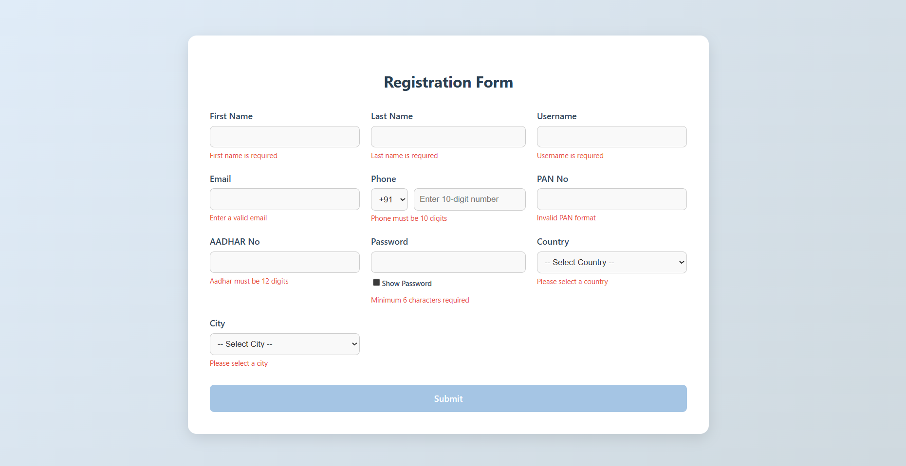
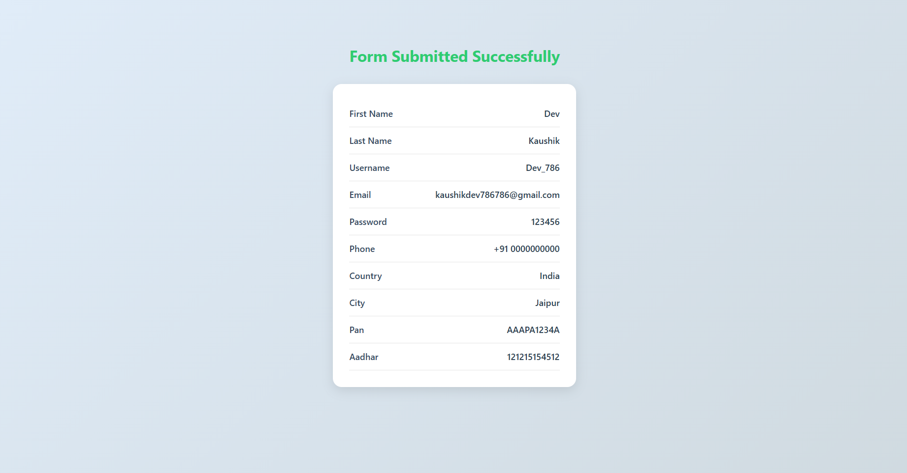

# 🌐 React Registration Form with Country Code and Validation

A modern and responsive registration form built using **React**, featuring full form validation, country and city selection, password visibility toggle, and a country code dropdown for phone numbers. Upon successful submission, a clean success page displays the entered data.

## ✨ Features

- Fully controlled form using React hooks (`useState`, `useEffect`)
- Real-time form validation with error display
- Country → city dynamic dropdown
- Country code selector (e.g., +91, +1, +44)
- Show/hide password toggle
- Conditional button disabling until form is valid
- Submission redirects to a success page showing all entered data
- Clean and readable UI (CSS included)

## 📂 Project Structure

project-root/
├── src/
│   ├── App.js              # React Router setup
│   ├── FormPage.jsx        # Main form component
│   ├── FormPage.css        # Styles for the form page
│   ├── SuccessPage.jsx     # Page shown after submission
│   ├── SuccessPage.css     # Styles for the success page
│   └── index.js            # React entry point
├── public/
│   └── index.html          # HTML template
├── assets/
│   ├── form-preview.png    # Screenshot of the form
│   └── success-page.png    # Screenshot of the success page
├── package.json            # Project metadata and dependencies
├── vite.config.js          # Vite config file
└── README.md               # You're reading it 🙂


## 🔧 How to Run Locally

1. **Clone the repo**
   ```bash
   git clone https://github.com/your-username/your-repo-name.git
   cd your-repo-name

2. Install dependencies
   npm install
3. Start the development server
   npm start
4. Visit in browser
   http://localhost:3000

🛠 Tech Stack
React (with Hooks)

React Router DOM

Plain CSS (no frameworks)

📸 Screenshots

Here is how the form looks:



Success page after submission:




📄 License
This project is open-source and available under the MIT License.

---

Let me know if you want me to include a `package.json`, `LICENSE`, or `deploy` guide too.

